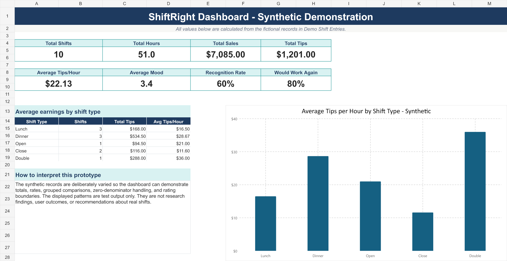
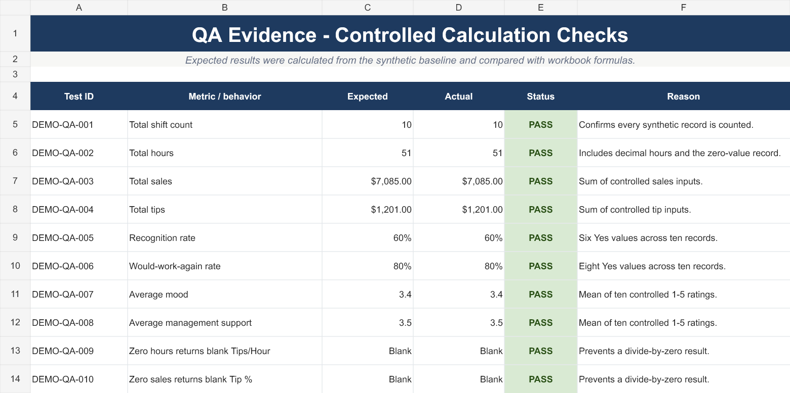

# ShiftRight Web Application QA Case Study

**Status:** Active, evidence-backed case study  
**Product:** Worker-focused shift tracking web application  
**Live application:** [shiftright.lovable.app](https://shiftright.lovable.app)

## At a glance

ShiftRight is a worker-focused project for recording financial and workplace-experience information across individual shifts. It brings hours, sales, tips, mood, energy, recognition, and management support into one structured record.

I created the product concept and shaped the application with AI-assisted tools, then approached the recovered web app and supporting workbook as a QA and product-support project. The current evidence demonstrates build verification, privacy-aware testing, one successful synthetic guest journey, controlled calculation checks, and clear documentation of what remains untested.

This case study does not claim validated workplace outcomes, completed authenticated testing, or representative user research.

## The problem

A worker may remember whether a shift felt good or bad, but those memories are difficult to compare over time. Financial results and workplace experience are often recorded in different places—or not recorded at all.

ShiftRight explores whether a consistent, worker-owned record can make those patterns easier to inspect. The current project demonstrates the data structure, application workflow, and early presentation approach. It does not prove that the product improves financial or workplace outcomes.

## My role

I created the ShiftRight concept and directed its development with help from AI-assisted tools. My contribution included:

- defining the worker problem and intended data points;
- shaping the product, content, and mobile-first application direction;
- organizing the app, workbook, brand, and QA materials;
- reviewing the application and identifying privacy and portability risks;
- separating synthetic demonstration data from private workplace data;
- using test findings to guide corrections and verification;
- documenting passing, failing, blocked, and not-run checks honestly.

I do not present AI-generated source code as evidence that I manually authored every line. My ownership is the problem definition, product direction, review, decisions, testing judgment, and evidence boundaries.

## Test approach

The completed work combines application, build, privacy, and calculation checks:

1. Recovered and sanitized the Lovable application source without importing its Git history or environment file.
2. Scanned the imported source for known credential patterns and configuration risks.
3. Repaired dependency-lock inconsistencies and verified clean installation, lint, and production build through GitHub Actions.
4. Performed read-only availability checks on the public landing, authentication, manifest, and robots routes.
5. Reviewed the guest shift-entry workflow for privacy-safe demonstration data.
6. Stopped testing when the restaurant selector exposed a real workplace/location label without a verified synthetic option.
7. Added and verified a clearly labeled **Portfolio Demo Restaurant** choice.
8. Submitted one fictional guest shift and compared the dashboard values with the controlled inputs.
9. Built and re-imported a separate synthetic workbook and checked ten expected calculations.

## Verified results

### Build and code-quality verification

- GitHub Actions completed `npm ci`, the configured lint command, and the production build successfully on Node.js 22.
- ESLint completed with zero errors and seven documented Fast Refresh warnings.
- The clean imported source excluded `.env`; the credential-pattern scan did not find the searched patterns.

These results verify build reproducibility in the tested CI environment. They do not verify application behavior or production integrations.

### Privacy defect and correction

During guest shift-entry review, the restaurant selector displayed a real workplace/location label and did not provide a verified synthetic choice. I stopped before submitting data.

A clearly labeled **Portfolio Demo Restaurant** option was added. The deployed application was then checked to confirm that the synthetic choice was present before testing continued.

### Synthetic guest journey

One fictional guest shift was submitted using the approved demonstration option. The resulting dashboard displayed:

- 1 recorded shift;
- $480 in sales;
- $96 in tips;
- $16.00 per hour;
- 6.0 hours;
- average mood of 4.0, labeled “Good.”

Those values matched the controlled inputs for the current guest session. Persistence across sessions or devices was not tested.

### Controlled workbook checks

A separate demonstration workbook was created with ten fictional records. After export and re-import:

- all four sheets rendered without visible clipping, overlap, or broken charts;
- no `#REF!`, `#DIV/0!`, `#VALUE!`, `#NAME?`, or `#N/A` values were found;
- expected and actual totals matched for shifts, hours, sales, tips, recognition rate, willingness-to-work-again rate, average mood, and average management support;
- zero hours returned a blank Tips/Hour result;
- zero sales returned a blank Tip % result;
- all ten controlled checks displayed `PASS`.

These are formula and presentation checks using synthetic test data. They are not evidence of product impact or user outcomes.

## Portfolio evidence

### Synthetic dashboard

This dashboard is calculated from ten fictional shift records. It demonstrates totals, grouped comparisons, zero-denominator handling, and rating boundaries. The displayed patterns are test output—not research findings or measured user outcomes.

### Controlled calculation checks

The QA sheet compares expected and actual results for ten controlled checks. Every displayed check passed in the reviewed workbook.

[Download the privacy-reviewed synthetic demonstration workbook](../assets/shiftright/ShiftRight_Portfolio_Demo.xlsx)

The workbook contains only explicitly labeled synthetic records. Its four visible sheets were reviewed for privacy, metadata, formula errors, and rendering quality before being added to this portfolio.

## Important limitations

The current evidence does not establish:

- completed authenticated end-to-end testing;
- persistence across sessions or devices;
- cross-browser or responsive behavior;
- API, database, authentication, authorization, or multi-user behavior;
- keyboard, screen-reader, contrast, zoom/reflow, or broader accessibility performance;
- performance, load, reliability, or recovery behavior;
- real-user usability or validated workplace outcomes.

The full repository remains private. The synthetic dashboard, QA evidence image, and demonstration workbook passed a publication review. The current Lovable landing-page screenshot is excluded because the café photograph used by the application does not yet have documented provenance or publication rights.

## Skills demonstrated

- Exploratory and black-box testing
- Expected-versus-actual analysis
- Privacy-aware stopping decisions
- Defect identification and verification
- Controlled synthetic test data
- Build and CI evidence interpretation
- Calculation verification
- Risk and limitation documentation
- AI-assisted product direction and QA judgment

## What I learned

- A passing build is valuable evidence, but it is not evidence that user workflows work.
- Synthetic demonstration data should be designed into a portfolio project before testing begins.
- A tester should stop when the available path could expose private information.
- Expected values make a small controlled dataset more useful than a larger unstructured one.
- Passing, failing, blocked, and not-run results all belong in a credible QA record.

---

[Return to all projects](projects.md) · [Return to the portfolio home](../index.html)
